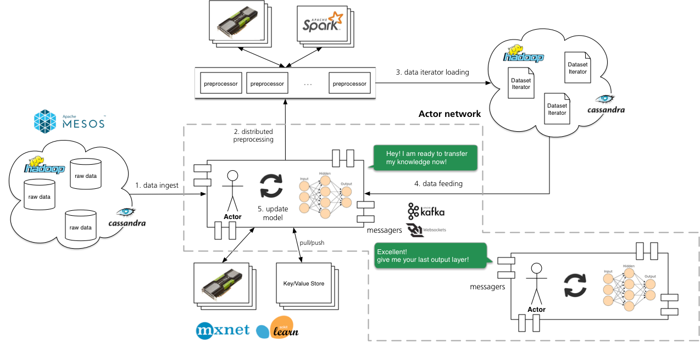

# H3 Machine Learning Core Library

H3 machine learning core library is an application oriented library for ML practitioners who intend to build actors based large scale learning system. The h3mlcore is the main project which is not another general purpose ML frameworks as existings ones, such as tensorflow, mxnet, caffee, or scikit-learn. Nevertheless we found that there're not enough features in those frameworks to help developers to build a full functional system. 

## Introduction 

We briefly introduce the h3mlcore project, mainly descript why and how we reshape some exisiting ML frameworks to help users integrate with systems more easily. 

### Motivation 

While there're many amazing machine learning libraries exist in open source communities, which help researchers and practitioners develop their own learning systems, we found that interfaces between big data systems and machine learning frameworks are generally missing. The main idea of the project is to develop a full functional actor-based machine learning framework which can help practitioners develop their own distributed applications driven by machine learning. 

In fact, most machine learning framework does not provide unified programing model to handle issues such as distribtued feature preprocessing, data ingest, iterator loading and feeding, as well as messaging among processes. We propose a actor based architecture to deal with current issues, which can be unified with a simple prgraming model.

### Actor network architecture 

A learning model is considered as an actor, which impersonates how human processes tasks. Actors connect with each other to form a actor network, where they share the layers, parameters or predictions with each other to help transfer learning. The architecture of actor network is depicted as following, 

## Dependencies 

## How to Install 

## Hello World Tutorial

## Authors and Copyright

## Acknowledge

